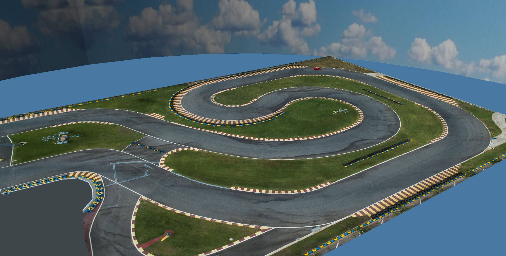
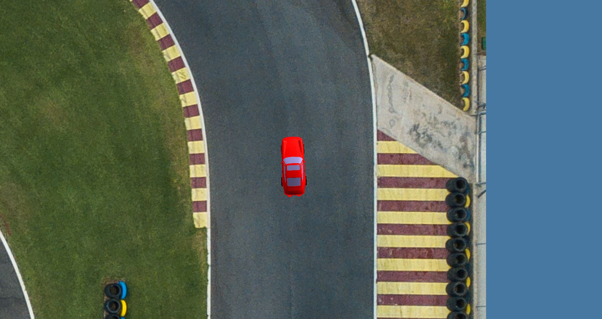

# Autonomous Race Car
Controller design for a self-driving car to drive down a track as fast as possible. The concepts demonstrated used 3D graphics

## 3D SImulation
In this project, we try to develop controllers for a race car to drive down the track in the fastest time possible. Th results are shown using a 3D graphics simulation. We use a custom-built 3D graphics library developed by Dr. Brandon Gordon. This library is made using The DirectX Toolkit from Microsoft. A picture of the #d environment built for our simulation can be seen below:

## Controller Design
We need 3 controllers:

**1. Steering:** The car should drive on the track as efficiently as possible without hitting the sides.

**2. Braking:** When we want the car to stop, it has to brake in a way as to prevent slipping of the tires on the road. This way, the brake distance will be the shortest.

**3. Speed/acceleration:** When the car accelerates, the tires need to spin in way as to prevent alipping. Therefore, we will have the most contact between tires and the road, which leads to better acceleration.

All three controllers above are PID controllers in nature. For braking and accelarion, we need a mathemathical model for the fraction between the tires and asphalt. For steering, we extract the equation of the middle line of the road and control the vehicle in a way as to follow thta line. 

If the user decides to brake, they can, they can press "B" on the keyboard. Moreover, the views of the track and car can be changed using keys 1, 2, 3, 4, and 5 each for a different view, as explained below:
* 1 - overhead view (3rd person perspective)
* 2 - driver view (1st person perspective)
* 3 - diagonal view (3rd person perspective)
* 4 - close up overhead driver view (1st person perspective)
* 5 - overhead driver view (1st person perspective)

When the user releasing the B key, the car accelerates as efficiently as possible to reach the maximum speed once again.

In the figure below, the car can be seen driving on the road and steering as necessary:
